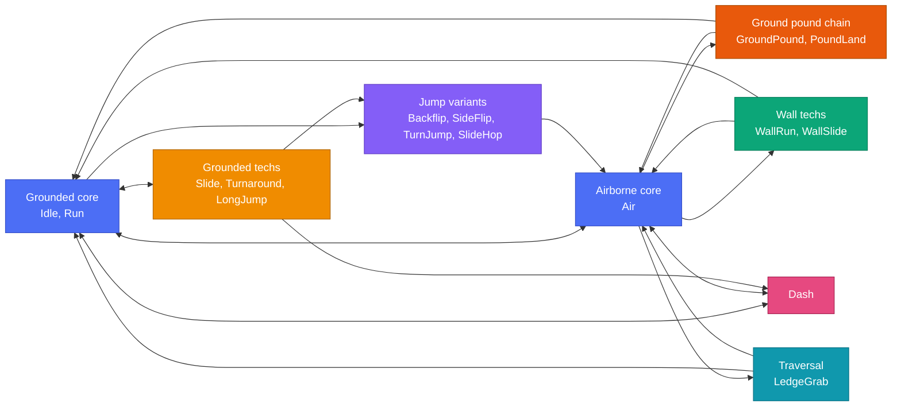
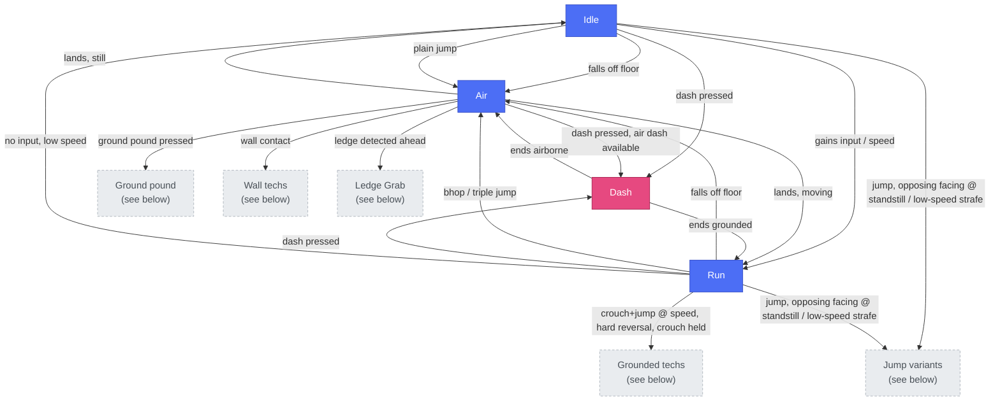
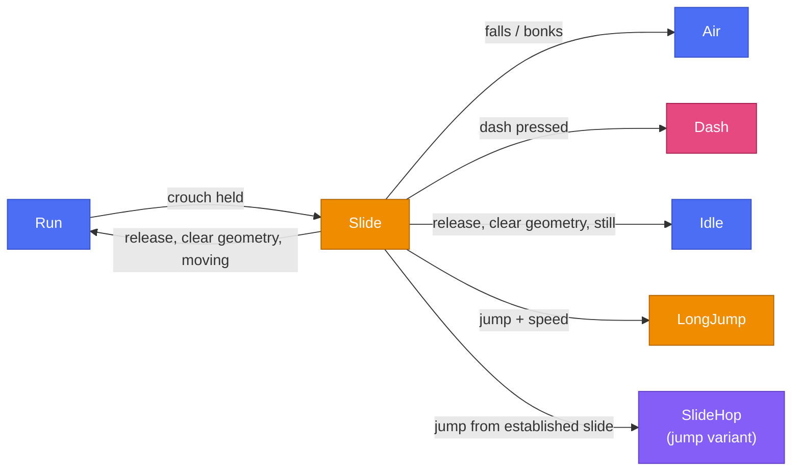
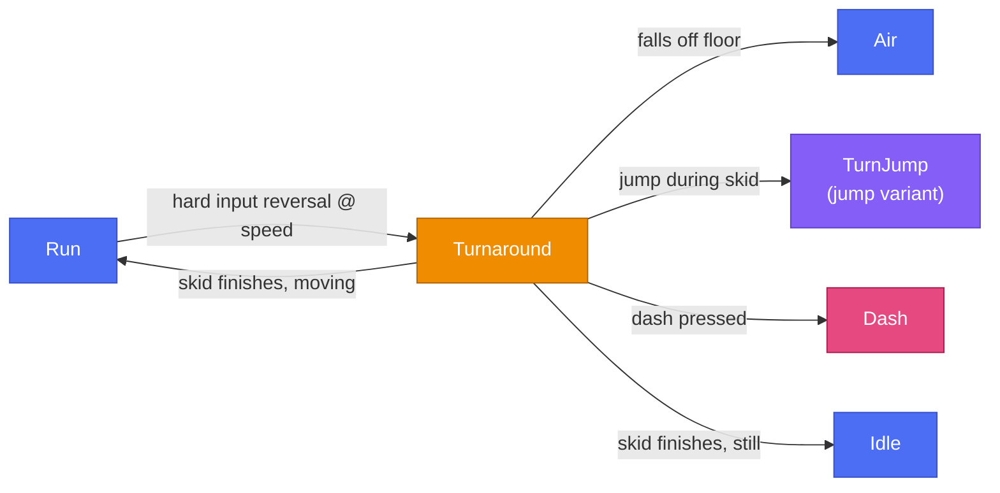
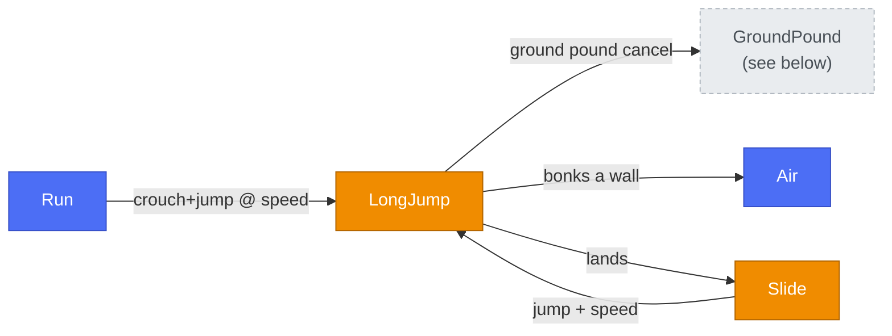
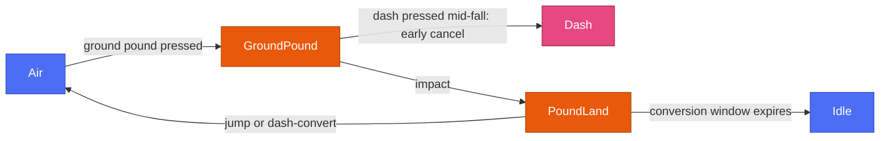
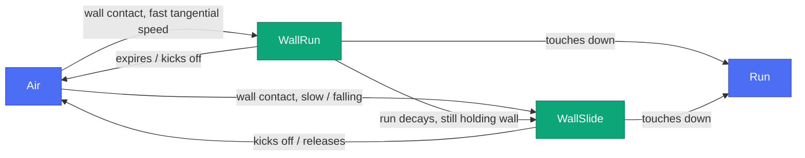
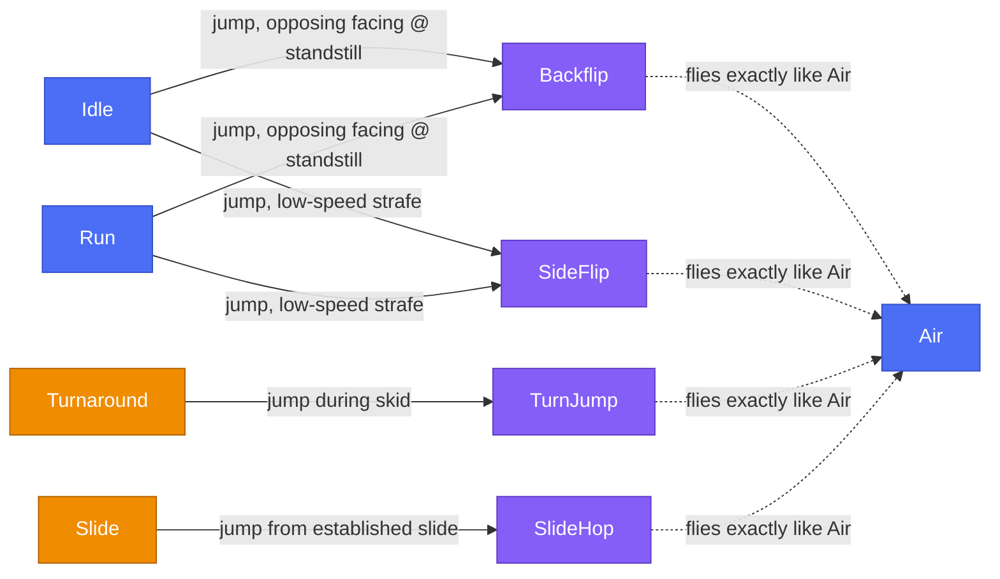
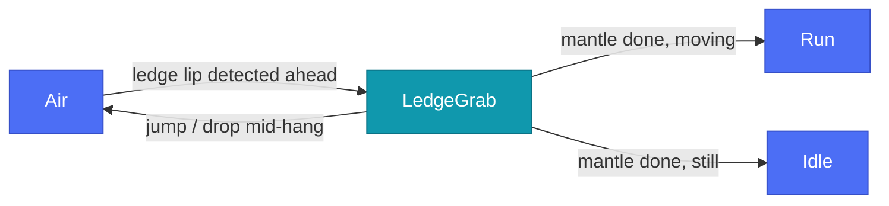

# Player state chart

Visual companion to the transition table in [MOVEMENT.md](MOVEMENT.md#state-machine).
Generated by reading every `change_to(...)` call in `src/player/states/*.gd`, so
it reflects the actual code, not just intent.

**How to view this rendered:** GitHub renders Mermaid natively. In VS Code
1.121+, it's built in too — open Preview (`Cmd+Shift+V`); if diagrams show
blank, make sure the old third-party `bierner.markdown-mermaid` extension
is uninstalled *and VS Code fully restarted* (not just reloaded), since the
two renderers conflict.

Each state's own neighborhood is broken out below so you can look at one
piece at a time. Grey dashed boxes in a diagram are states that belong to
a different section — they're shown only as the connection point; follow
the link to see their own detail.

## Contents

1. [Big picture](#big-picture)
2. [Core loop — Idle, Run, Air, Dash](#core-loop--idle-run-air-dash)
3. [Slide](#slide)
4. [Turnaround](#turnaround)
5. [Long Jump](#long-jump)
6. [Ground pound chain](#ground-pound-chain)
7. [Wall techs — Wall Run, Wall Slide](#wall-techs--wall-run-wall-slide)
8. [Jump variants — Backflip, Side Flip, Turn Jump, Slide Hop](#jump-variants--backflip-side-flip-turn-jump-slide-hop)
9. [Traversal — Ledge Grab](#traversal--ledge-grab)
10. [Full diagram, everything at once](#full-diagram-everything-at-once) (reference only — this is the view that got overwhelming)

---

## Big picture

Zoomed all the way out: families of states, not individual transitions.
This is the map; the sections below are the territory.

- **`Air` is the universal hub** — every jump, fall, kick, or boost passes
  through it or one of its four jump variants.
- **`Dash` is reachable from almost anywhere** and always exits straight
  back to `Air` or `Run` — it never lingers.
- Nothing is a dead end: every family loops back to the grounded core
  eventually.

[↑ Back to contents](#contents)

---

## Core loop — Idle, Run, Air, Dash

The state machine's resting loop. Everything else is a detour that
eventually returns here.

[↑ Back to contents](#contents)

---

## Slide

Crouch-held ground tech launched from `Run`.

- Holding Crouch/Slide never fully arrests you — speed decays only to a
  sustain floor.
- Landing a jump *from* the slide with crouch still held re-enters `Slide`
  (via `SlideHop`, an `Air`-family state — see [jump
  variants](#jump-variants--backflip-side-flip-turn-jump-slide-hop)), so
  slide → hop → slide chains flow.

[↑ Back to contents](#contents)

---

## Turnaround

Grounded skid triggered by reversing input hard while running above a
speed threshold.

- Grounded-trigger only — gated off the bunny-hop landing window, so it
  never competes with a bhop.
- Letting the skid finish pivots cleanly into the new facing; jumping
  during the skid is the **Turn Jump** instead (higher apex, small forward
  pop).

[↑ Back to contents](#contents)

---

## Long Jump

Crouch + jump above a speed threshold, launched from `Run` or `Slide`.

- Velocity is committed at launch — **no air control**. Ground pound is
  the only mid-air cancel; bonking a wall returns control.
- Lands into a `Slide`; enough surviving speed and an immediate re-jump
  chains into another Long Jump, Mario-64 style.

[↑ Back to contents](#contents)

---

## Ground pound chain

Two-stage tech: commit to the slam in `GroundPound`, then convert on
impact in `PoundLand`.

- `PoundLand` opens a 0.3s conversion window: dash converts stored impact
  speed into a big horizontal boost, jump becomes a super jump, doing
  nothing just ends the pound with the momentum spent.
- Dashing mid-fall (before impact) is an early cancel into a plain air
  dash instead.

[↑ Back to contents](#contents)

---

## Wall techs — Wall Run, Wall Slide

Share the same wall-contact detection; which one you get depends purely on
incoming tangential speed.

- `WallSlide` is the low-speed chimney tool (two facing walls = climbable
  chimney); `WallRun` is the high-speed traversal tool.
- A `WallRun` that runs out of time decays into a `WallSlide` if you're
  still holding toward the wall.

[↑ Back to contents](#contents)

---

## Jump variants — Backflip, Side Flip, Turn Jump, Slide Hop

These four don't transition *between* each other — each just has its own
entry trigger, then **inherits `AirState`'s entire `physics_update()`
wholesale** (`extends AirState` in code). So once launched, all four fly,
land, wall-contact, and ledge-grab exactly like plain `Air`, including
every exit `Air` has (`GroundPound`, `Dash`, `Run`, `Idle`, `LedgeGrab`,
`WallRun`, `WallSlide`). The one variant-specific rule: buffering a jump on
the landing frame (a bunny hop) snaps you into plain `Air` rather than
replaying the variant's launch animation.

- **Backflip** — near-standstill, pushing away from facing.
- **Side Flip** — low-speed strafing input.
- **Turn Jump** — jump during a `Turnaround` skid.
- **Slide Hop** — jump out of an established `Slide`.

All four give a small pop in a variant-specific direction with *no forward
commitment* (the opposite of Long Jump) and otherwise fly like a normal
jump.

[↑ Back to contents](#contents)

---

## Traversal — Ledge Grab

Auto-mantle, only entered from `Air`.

- Triggered near apex or while falling toward a ledge lip (raycast probe).
- Brief hang, then automatic mantle onto the lip. During the hang: jump
  wall-kicks away, crouch drops.

[↑ Back to contents](#contents)

---

## Full diagram, everything at once

```mermaid
flowchart TD
    subgraph Grounded["Grounded core"]
        Idle
        Run
    end

    subgraph Aerial["Airborne core"]
        Air
    end

    subgraph Variants["Jump variants — extend AirState, inherit its exits"]
        Backflip
        SideFlip
        TurnJump
        SlideHop
    end

    subgraph Pound["Ground pound chain"]
        GroundPound
        PoundLand
    end

    subgraph WallTech["Wall techs"]
        WallSlide
        WallRun
    end

    subgraph GroundTech["Grounded techs"]
        Slide
        Turnaround
        LongJump
    end

    subgraph Travel["Traversal"]
        LedgeGrab
    end

    Dash

    Idle -->|falls off floor| Air
    Idle -->|jump, opposing facing @ standstill| Backflip
    Idle -->|jump, low-speed strafe| SideFlip
    Idle -->|plain jump| Air
    Idle -->|dash pressed| Dash
    Idle -->|gains input / speed| Run

    Run -->|falls off floor| Air
    Run -->|crouch+jump @ speed| LongJump
    Run -->|jump, opposing facing @ standstill| Backflip
    Run -->|jump, low-speed strafe| SideFlip
    Run -->|bhop / triple jump| Air
    Run -->|dash pressed| Dash
    Run -->|hard input reversal @ speed| Turnaround
    Run -->|crouch held| Slide
    Run -->|no input, low speed| Idle

    Air -->|ground pound pressed| GroundPound
    Air -->|dash pressed, air dash available| Dash
    Air -->|lands, moving| Run
    Air -->|lands, still| Idle
    Air -->|ledge detected ahead| LedgeGrab
    Air -->|wall contact, fast tangential speed| WallRun
    Air -->|wall contact, slow / falling| WallSlide

    Backflip -.->|inherits all Air exits + bhop relaunch| Air
    SideFlip -.->|inherits all Air exits + bhop relaunch| Air
    TurnJump -.->|inherits all Air exits + bhop relaunch| Air
    SlideHop -.->|inherits all Air exits + bhop relaunch| Air

    Dash -->|ends airborne| Air
    Dash -->|ends grounded| Run

    GroundPound -->|dash pressed mid-fall: cancel| Dash
    GroundPound -->|impact| PoundLand
    PoundLand -->|conversion window expires| Idle
    PoundLand -->|jump or dash-convert| Air

    LongJump -->|ground pound cancel| GroundPound
    LongJump -->|bonks a wall| Air
    LongJump -->|lands| Slide

    LedgeGrab -->|jump / drop mid-hang| Air
    LedgeGrab -->|mantle done, moving| Run
    LedgeGrab -->|mantle done, still| Idle

    Slide -->|falls / bonks| Air
    Slide -->|dash pressed| Dash
    Slide -->|release, clear, moving| Run
    Slide -->|release, clear, still| Idle
    Slide -->|jump + speed| LongJump
    Slide -->|jump from established slide| SlideHop

    Turnaround -->|falls off floor| Air
    Turnaround -->|jump during skid| TurnJump
    Turnaround -->|dash pressed| Dash
    Turnaround -->|skid finishes, moving| Run
    Turnaround -->|skid finishes, still| Idle

    WallRun -->|expires / kicks off| Air
    WallRun -->|touches down| Run
    WallRun -->|run decays, still holding wall| WallSlide
    WallSlide -->|kicks off / releases| Air
    WallSlide -->|touches down| Run

    classDef core fill:#4c6ef5,color:#fff,stroke:#364fc7;
    classDef variant fill:#845ef7,color:#fff,stroke:#5f3dc4;
    classDef pound fill:#e8590c,color:#fff,stroke:#a94a00;
    classDef wall fill:#0ca678,color:#fff,stroke:#087f5b;
    classDef ground fill:#f08c00,color:#fff,stroke:#b06400;
    classDef travel fill:#1098ad,color:#fff,stroke:#0b7285;
    classDef dash fill:#e64980,color:#fff,stroke:#a61e4d;

    class Idle,Run,Air core
    class Backflip,SideFlip,TurnJump,SlideHop variant
    class GroundPound,PoundLand pound
    class WallSlide,WallRun wall
    class Slide,Turnaround,LongJump ground
    class LedgeGrab travel
    class Dash dash
```

Expand only if you actually want the wall-of-arrows view (this is the one that prompted breaking the doc apart — the sections above are the useful version).

[↑ Back to contents](#contents)

---

For the design intent and tuning behind each move (why a bhop preserves
speed, what the pound conversion window does, etc.), see the "movement
kit" section of [MOVEMENT.md](MOVEMENT.md).
